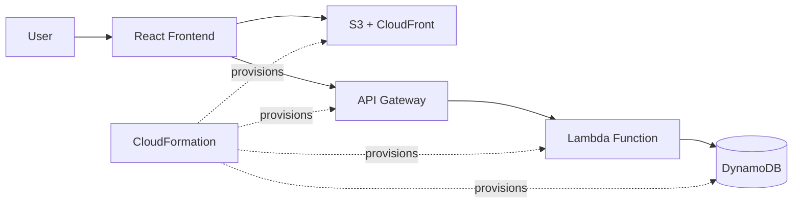

# Student Task Manager on AWS


> A review-ready full-stack task manager that demonstrates serverless architecture and Infrastructure as Code on AWS.

## Project Overview

Students often learn cloud services separately but do not see how a complete application connects them. This project closes that gap with a practical task manager. A user can add, view, complete, and delete tasks through a React interface while AWS services handle the API, compute, storage, and delivery layers.

The main academic focus is **AWS CloudFormation**: the cloud environment is described in YAML so it can be created, updated, reviewed, and removed consistently instead of being configured manually in the AWS Console.

## Why This Project Matters

- Converts cloud theory into a working full-stack workflow.
- Demonstrates a real serverless request path from browser to database.
- Shows repeatable Infrastructure as Code with a readable CloudFormation template.
- Applies least-privilege IAM permissions to the Lambda function.
- Keeps the scope focused enough for a clear B.Tech review and viva.

## Architecture



### Request Flow

1. The user performs an action in the React frontend.
2. The frontend sends an HTTP request to API Gateway.
3. API Gateway invokes the Lambda backend.
4. Lambda validates the request and reads or writes task data in DynamoDB.
5. The response is returned as JSON and displayed in the interface.

## Key Features

- View all tasks
- Add a new task with input validation
- Mark a task as complete or undo completion
- Delete a task
- Loading, empty, and error states in the frontend
- REST API endpoints for task CRUD operations
- Local mock mode for frontend demonstration without a deployed API
- CloudFormation parameters and outputs for repeatable deployment

## Technology Stack

| Layer | Technology | Purpose |
| --- | --- | --- |
| Frontend | React, Vite, JavaScript | Task management interface |
| API | Amazon API Gateway | Public REST endpoints |
| Compute | AWS Lambda, Node.js | Serverless business logic |
| Database | Amazon DynamoDB | Persistent task storage |
| Delivery | Amazon S3, CloudFront | Static hosting and CDN delivery |
| Security | AWS IAM | Least-privilege permissions |
| Infrastructure | AWS CloudFormation | Automated resource provisioning |

## Rubric Alignment

| Review Area | Evidence in This Project |
| --- | --- |
| Problem definition | A practical task manager demonstrates how cloud services work together. |
| Functional requirements | Add, view, complete, and delete task workflows are implemented. |
| Architecture and design | The frontend, API, Lambda, database, and delivery flow are documented. |
| Cloud implementation | AWS API Gateway, Lambda, DynamoDB, S3, and CloudFront are used. |
| Infrastructure as Code | Resources, dependencies, parameters, and outputs are defined in YAML. |
| Security | Lambda receives only the DynamoDB and CloudWatch permissions it needs. |
| Quality and usability | Validation, loading feedback, error handling, and readable structure are included. |
| Future scope | Authentication, monitoring, CI/CD, and user-specific task lists are identified. |

## Project Structure

```text
CC/
├── frontend/              # React + Vite user interface
├── backend/               # Lambda handler and task API
├── infrastructure/        # CloudFormation template
├── docs/                   # Requirements, architecture, and viva notes
├── package.json            # Root development commands
└── README.md              # Project and review guide
```

## Run Locally

### Frontend

```bash
cd frontend
npm install
cp .env.example .env
npm run dev
```

Set `VITE_API_URL` in `.env` to the deployed API Gateway URL. If it is left as a placeholder, the application uses local browser storage so the interface can still be demonstrated.

### Backend Check

```bash
cd backend
npm install
node --check src/handler.js
```

## CloudFormation Workflow

```bash
aws cloudformation validate-template \
  --template-body file://infrastructure/template.yaml \
  --region ap-south-1

aws cloudformation create-stack \
  --stack-name student-task-stack \
  --template-body file://infrastructure/template.yaml \
  --capabilities CAPABILITY_IAM \
  --parameters ParameterKey=EnvironmentName,ParameterValue=dev \
  --region ap-south-1
```

CloudFormation outputs the API URL, frontend bucket name, CloudFront URL, DynamoDB table name, and Lambda function name. These outputs connect deployment information to the application configuration.

## Deployment Steps

Before running deployment commands, replace the placeholder values below:

- STACK_NAME: your CloudFormation stack name, for example `student-task-stack`
- REGION: your AWS region, for example `ap-south-1`
- FRONTEND_BUCKET_NAME: a globally unique S3 bucket name if you choose a custom bucket name
- ACCOUNT_ID: your AWS account ID

### 1. Install project dependencies

```bash
cd frontend
npm install

cd ../backend
npm install
```

### 2. Configure AWS CLI

```bash
aws configure
aws sts get-caller-identity
```

### 3. Validate the template

```bash
aws cloudformation validate-template --template-body file://infrastructure/template.yaml --region ap-south-1
```

### 4. Create the stack

```bash
aws cloudformation create-stack \
  --stack-name student-task-stack \
  --template-body file://infrastructure/template.yaml \
  --capabilities CAPABILITY_IAM \
  --parameters ParameterKey=EnvironmentName,ParameterValue=dev \
  --region ap-south-1
```

### 5. Update the stack

```bash
aws cloudformation update-stack \
  --stack-name student-task-stack \
  --template-body file://infrastructure/template.yaml \
  --capabilities CAPABILITY_IAM \
  --parameters ParameterKey=EnvironmentName,ParameterValue=dev \
  --region ap-south-1
```

### 6. Get stack outputs

```bash
aws cloudformation describe-stacks \
  --stack-name student-task-stack \
  --region ap-south-1 \
  --query 'Stacks[0].Outputs'
```

### 7. Run the frontend locally

```bash
cd frontend
cp .env.example .env
npm install
npm run dev
```

### 8. Test the API

```bash
curl https://YOUR_API_ID.execute-api.ap-south-1.amazonaws.com/prod/tasks
curl -X POST https://YOUR_API_ID.execute-api.ap-south-1.amazonaws.com/prod/tasks \
  -H "Content-Type: application/json" \
  -d '{"title":"Complete AWS project"}'
```

### 9. Delete the stack

```bash
aws cloudformation delete-stack \
  --stack-name student-task-stack \
  --region ap-south-1
```

## API Endpoints

- GET /tasks
- POST /tasks
- PUT /tasks/{id}
- DELETE /tasks/{id}

## Review Summary

This project demonstrates a complete serverless web application using React and AWS. It connects API Gateway, Lambda, and DynamoDB to implement task management operations, while S3 and CloudFront deliver the frontend. CloudFormation defines the infrastructure as code, making deployment repeatable and maintainable. The project provides evidence of knowledge in cloud architecture, REST APIs, serverless computing, NoSQL databases, IAM, and automated infrastructure management.

## Future Enhancements

- Add authentication and user-specific task lists.
- Add better validation and UI polish.
- Use CI/CD to deploy the frontend and CloudFormation updates.
- Add monitoring with CloudWatch logs and alarms.

## Future Enhancements

- Add authentication and user-specific task lists.
- Add CloudWatch dashboards, alarms, and structured logging.
- Add a CI/CD pipeline for frontend and infrastructure deployment.
- Add a custom domain and HTTPS configuration with Route 53 and ACM.

## Academic Value

The project is intentionally small enough to explain clearly, but complete enough to demonstrate the full cloud application lifecycle: requirements, design, implementation, deployment, security, and future scalability.
