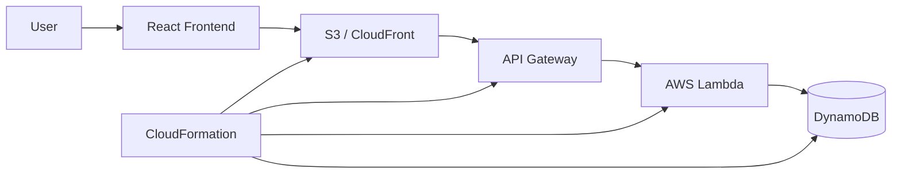

# Architecture and Design

## 1. Project Title
AWS CloudFormation Infrastructure as Code for a Full Stack Application

## 2. Problem Statement
Many students and beginners learn cloud services in theory but do not understand how those services work together in a real application. There is often a gap between learning AWS concepts and implementing a complete system. This project solves that by demonstrating a simple full-stack app deployed with Infrastructure as Code.

## 3. Motivation
The aim is to show a real-world architecture using serverless AWS services. A small task management application is enough to explain how frontend, API, compute, and database services interact. It also helps students understand cloud architecture in a practical, review-friendly way.

## 4. Proposed Solution
The proposed solution is a simple task management application with React frontend, Lambda backend, API Gateway, and DynamoDB. The complete cloud environment is created using AWS CloudFormation YAML templates. This approach helps automate infrastructure creation, reduce manual errors, and make deployment repeatable.

## 5. Objectives
- Design a simple full-stack web application.
- Use AWS services that match the expected architecture.
- Implement Infrastructure as Code using CloudFormation.
- Connect frontend, backend, and database through AWS-managed services.
- Make the project understandable for viva and review.

## 6. Architecture Diagram Description
The user interacts with the React frontend. The frontend is stored in Amazon S3 and delivered through Amazon CloudFront. The frontend makes HTTP requests to API Gateway, which forwards the requests to AWS Lambda. Lambda processes the requests and interacts with DynamoDB to read or write task data. CloudFormation manages the provisioning and dependency flow of these resources.

## 7. AWS Services Used
- Amazon S3: frontend hosting
- Amazon CloudFront: content delivery
- Amazon API Gateway: REST API exposure
- AWS Lambda: backend business logic
- Amazon DynamoDB: persistent storage
- IAM: permissions for Lambda
- AWS CloudFormation: infrastructure automation

## 8. Why Each AWS Service Is Used
- S3 is used to host the static frontend because it is cheap, simple, and suitable for static site delivery.
- CloudFront is used to distribute the frontend globally and improve reachability and performance.
- API Gateway is used to create REST endpoints in a serverless architecture.
- Lambda is used because it runs code without managing servers.
- DynamoDB is used because it is a fast NoSQL database for key-value or document-based storage.
- IAM is used to enforce least-privilege access to AWS resources.
- CloudFormation is chosen because it allows infrastructure creation through code and version control.

## 9. CloudFormation Role
AWS CloudFormation is the central automation layer. It creates all required resources from a YAML template, defines parameters, sets output values, and ensures that resources are created in the correct order. This makes the deployment process repeatable, readable, and easier to explain.

## 10. Application Data Flow
The user enters task information in the frontend. The frontend sends an HTTP request to API Gateway. API Gateway invokes Lambda. Lambda reads or writes data in DynamoDB based on the request method. The result is returned to the frontend as JSON, where it is displayed in the task list.

## 11. Deployment Flow
1. Write CloudFormation YAML template.
2. Validate the template using AWS CLI.
3. Create the stack with CloudFormation.
4. CloudFormation provisions the DynamoDB table, API Gateway, Lambda role, Lambda function, and bucket resources.
5. Deploy the frontend to S3 or connect it via CloudFront.
6. Configure the frontend API URL from the CloudFormation outputs.

## 12. Expected Result
The deployed system should allow a user to view tasks, add tasks, mark tasks as complete, and delete tasks. The project should clearly show that AWS resources are created automatically from a single CloudFormation definition.

## 13. Future Enhancements
- Add authentication and user-specific task lists.
- Add CloudWatch monitoring and logs.
- Add CI/CD pipeline for automatic deployment.
- Use a custom domain with Route 53.
- Improve frontend with better validation and UI features.
